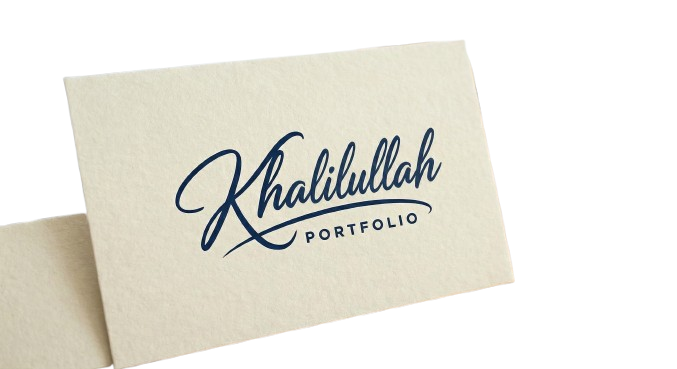

# 👨‍💻 Khalilullah Nohri | Software & DevOps Engineer Portfolio

<!--  -->


A modern, high-performance personal portfolio website built to showcase my experience in **Full-Stack Development**, **Cloud Automation**, and **DevOps Engineering**.

This project highlights my technical expertise through a responsive design, smooth animations, and a structured showcase of my professional journey.

---

## 🚀 Tech Stack

### **Core Frameworks & Languages**
[](https://nextjs.org/)
[](https://reactjs.org/)
[](https://www.typescriptlang.org/)

### **Styling & UI**
[](https://tailwindcss.com/)
[](https://www.framer.com/motion/)
[](https://lucide.dev/)

### **Functionality & Forms**
[](https://web3forms.com/)
[](https://github.com/pacocoursey/next-themes)

### **Deployment & Tooling**
[](https://vercel.com/)
[](https://eslint.org/)

---

## ✨ Key Features

- **🎨 Modern UI/UX:** Built with a clean, glassmorphism-inspired design using Tailwind CSS.
- **🌙 Dark/Light Mode:** Fully integrated theme switching with `next-themes` and system preference detection.
- **⚡ High Performance:** Optimized with Next.js App Router, Server Components, and `next/image`.
- **🎭 Smooth Animations:** Powered by **Framer Motion** for scroll-triggered reveals, timeline effects, and interactive hover states.
- **📱 Fully Responsive:** Mobile-first architecture ensuring perfect display on all devices.
- **📧 Functional Contact Form:** Integrated **Web3Forms** API to receive emails directly from the portfolio.
- **🔍 SEO Optimized:** Configured metadata, OpenGraph tags, and semantic HTML for better search engine visibility.

---

## 🛠️ Installation & Local Development

Follow these steps to run the portfolio locally on your machine.

1.  **Clone the repository**
    ```bash
    git clone https://github.com/Khalilullah-Nohri/khalilullah-portfolio.git
    cd khalilullah-portfolio
    ```

2.  **Install dependencies**
    ```bash
    npm install
    # or
    yarn install
    ```

3.  **Run the development server**
    ```bash
    npm run dev
    ```

4.  **Open in Browser**
    Visit [http://localhost:3000](http://localhost:3000) to see the application.

---

## 📂 Project Structure

```text
khalilullah-portfolio
├── public                          # Static assets (images, icons, PDFs) served from root
│   ├── Khalilullah-Resume.pdf      # Downloadable Resume/CV
│   ├── cert-genai.png              # Certification images
│   ├── cert-internspk.jpg
│   ├── cert-nibaf.jpg
│   ├── cert-pcap.jpg
│   ├── cert-systems.jpg
│   ├── cert-techkorner.jpg
│   ├── dashboard-app.png           # Project screenshots
│   ├── file.svg
│   ├── fyp-app2.jpeg
│   ├── globe.svg                   # UI Icons/Assets
│   ├── grid-pattern.svg            # Background patterns
│   ├── images.png
│   ├── logo.png                    # Site Logo
│   ├── nbp-advanced-salary-app.PNG
│   ├── noise.svg                   # Texture assets
│   ├── profile.jpg                 # Hero section profile photo
│   ├── ssgc-desktop-app.jpg
│   ├── upwork-project.PNG
│   ├── vercel.svg
│   └── window.svg
├── src
│   ├── app                         # Next.js App Router directory
│   │   ├── favicon.ico             # Browser tab icon
│   │   ├── globals.css             # Global styles & Tailwind imports
│   │   ├── layout.tsx              # Root layout (Metadata, Fonts, Providers)
│   │   └── page.tsx                # Main Landing Page (Home)
│   ├── components
│   │   ├── sections                # Modular sections used on the homepage
│   │   │   ├── About.tsx           # 'About Me' section component
│   │   │   ├── Certifications.tsx  # Certification carousel/grid
│   │   │   ├── Contact.tsx         # Contact form with Web3Forms
│   │   │   ├── Education.tsx       # Academic history timeline
│   │   │   ├── Experience.tsx      # Professional experience timeline
│   │   │   ├── Hero.tsx            # Top banner/Intro section
│   │   │   ├── Projects.tsx        # Project portfolio grid
│   │   │   └── Skills.tsx          # Tech stack & skills display
│   │   ├── ui                      # Reusable UI utility components
│   │   │   ├── ScrollToTop.tsx     # Floating 'Back to Top' button
│   │   │   └── SectionWrapper.tsx  # Wrapper for consistent section spacing/animation
│   │   ├── Footer.tsx              # Site footer
│   │   ├── Navbar.tsx              # Responsive navigation bar
│   │   └── ThemeProvider.tsx       # Context provider for Dark/Light mode
│   └── data                        # Static content data (Separated from UI logic)
│       ├── certifications.ts       # Array of certificate objects
│       ├── experience.ts           # Job history data
│       ├── projects.ts             # Projects description & links
│       └── skills.ts               # Skills categories and icons
├── README.md                       # Project documentation
├── eslint.config.mjs               # Linter configuration
├── next-env.d.ts                   # TypeScript declarations for Next.js
├── next.config.ts                  # Next.js build configuration
├── package-lock.json               # Dependency version lock file
├── package.json                    # Project dependencies & scripts
├── postcss.config.mjs              # PostCSS configuration for Tailwind
└── tsconfig.json                   # TypeScript configuration
```

## 🚀 Deployment

This project is optimized for deployment on **Vercel**.

1. Push code to GitHub.
2. Import repository into Vercel.
3. Click **Deploy**.

---

## 📬 Contact

**Khalilullah Nohri** *Software Engineer | DevOps & Cloud*

🌐 **LinkedIn:** [linkedin.com/in/khalilullah-dev](https://www.linkedin.com/in/khalilullah-dev)  
🐙 **GitHub:** [github.com/Khalilullah-Nohri](https://github.com/Khalilullah-Nohri)  
📧 **Email:** [nohrikhalilullah@gmail.com](mailto:nohrikhalilullah@gmail.com)

---

© 2026 Khalilullah Nohri. Built with Next.js & Tailwind.
